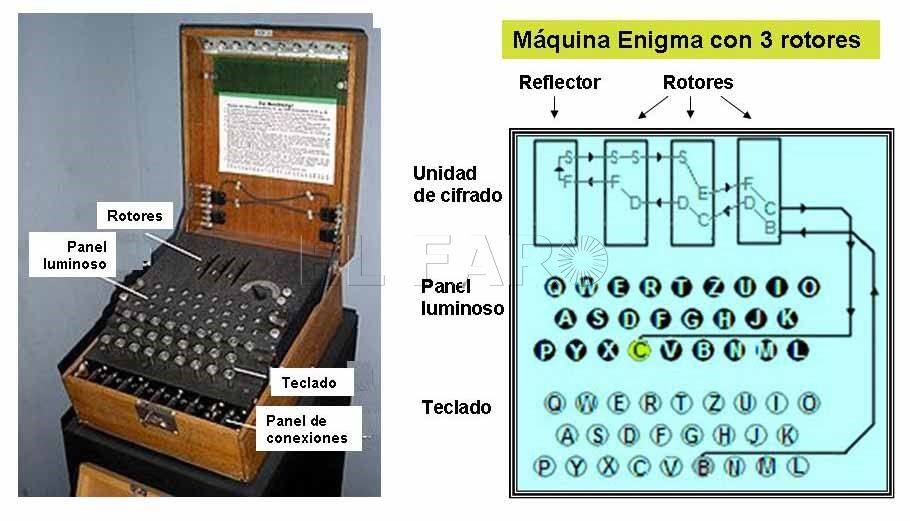

# Código Enigma
Enigma fue una máquina de rotores diseñada para cifrar y descifrar mensajes. Patentada en 1918 por la empresa alemana Scherbius y Ritter, y cofundada por Arthur Scherbius, quien había comprado la patente de un inventor neerlandés, se puso a la venta en 1923 para un uso comercial.  En 1926, la Armada alemana la adoptó para uso militar y poco después su uso se extendió a las demás fuerzas armadas alemanas,  especialmente durante la Segunda Guerra Mundial.3

Su facilidad de manejo y su aparente robustez criptográfica fueron las principales razones para su implantación. Sin embargo, gracias a las investigaciones llevadas a cabo por los servicios de inteligencia polacos, quienes instruyeron a su vez a los servicios franceses e ingleses en el sistema de cifrado, este fue finalmente descubierto, lo que precipitó el desenlace de la Segunda Guerra Mundial en favor de los Aliados. Estos aprovecharon además los fallos en los procedimientos de uso por parte de los operadores alemanes, que permitieron la interceptación de las tablas de descifrado y la captura de algunos aparatos.

